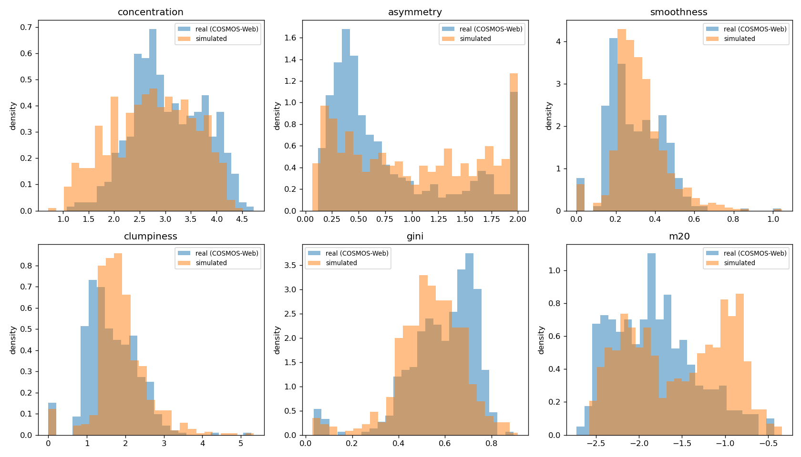

# Phase 7: CAS / Gini / M20 real vs. simulated comparison

Real sample (COSMOS-Web): 435 lenses, 435 with valid metrics.
Simulated sample: 680 lenses, 651 with valid metrics.

| metric | real n | real mean | real median | sim n | sim mean | sim median | range check |
|---|---|---|---|---|---|---|---|
| concentration | 435 | 3.050 | 2.938 | 651 | 2.755 | 2.780 | OK |
| asymmetry | 435 | 0.785 | 0.529 | 651 | 1.016 | 0.947 | OK |
| smoothness | 435 | 0.297 | 0.274 | 651 | 0.323 | 0.306 | OK |
| clumpiness | 435 | 1.640 | 1.536 | 651 | 1.881 | 1.795 | OK |
| gini | 435 | 0.587 | 0.619 | 651 | 0.537 | 0.537 | OK |
| m20 | 435 | -1.821 | -1.843 | 651 | -1.537 | -1.516 | OK |

Range checks: Gini in [0,1], concentration > 0, M20 < 0 (expected for centrally-concentrated light profiles).

